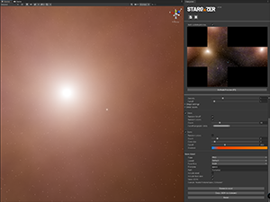

# <br>
<br>
Unity editor extension for procedually generating space skyboxes<br>

## Installation
There is couple of ways to install package. You can manually edit `manifest.json` inside Packages folder or use Unity Package Manager and import from url.

### Manual
Add following line to `./Packages/manifest.json` under `dependencies` section:<br>
```
"com.whreality.stargazer": "https://github.com/WhReality/com.whreality.stargazer.git"
```


Example of complete `manifest.json`:
```
{
  "dependencies": {
    "com.whreality.stargazer": "https://github.com/WhReality/com.whreality.stargazer.git",
  }
}

```
### Package manager
- Select `Add package from GIT url` 
- Insert url: `https://github.com/WhReality/com.whreality.stargazer.git`

## JSON Import/Export
Editor parameters can be imported/exported in JSON format. 

### Export
If you select `Save JSON` Stargazer will save `JSON` file from settings wich image was generated from.
### Import
You can import parameters by clicking Import Icon in the top menu. 

## Development
https://github.com/WhReality/Stargazer